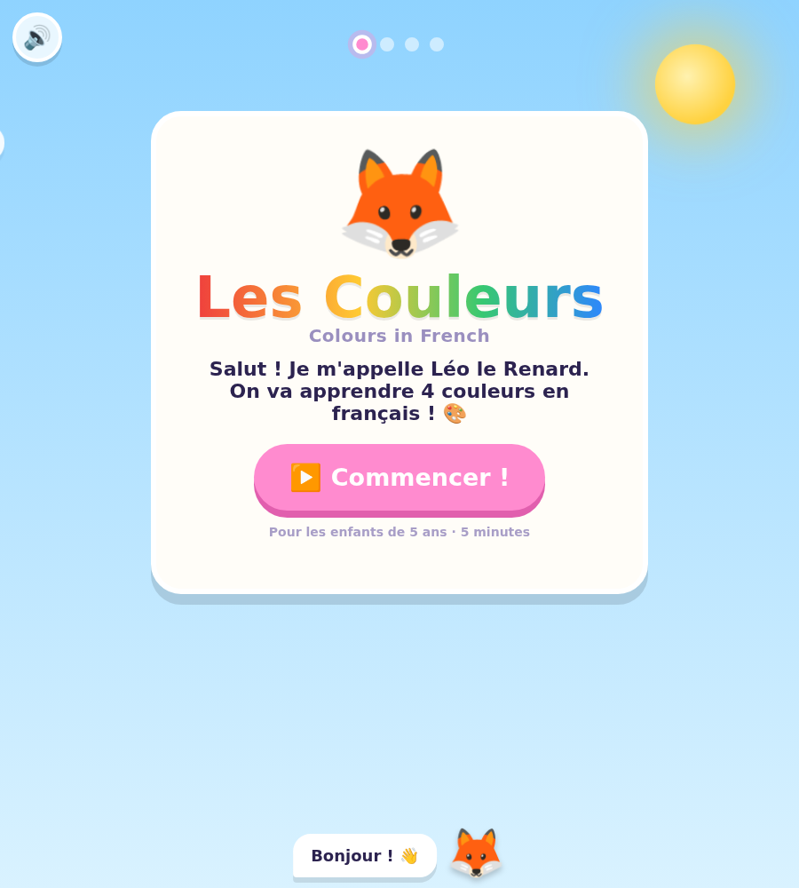
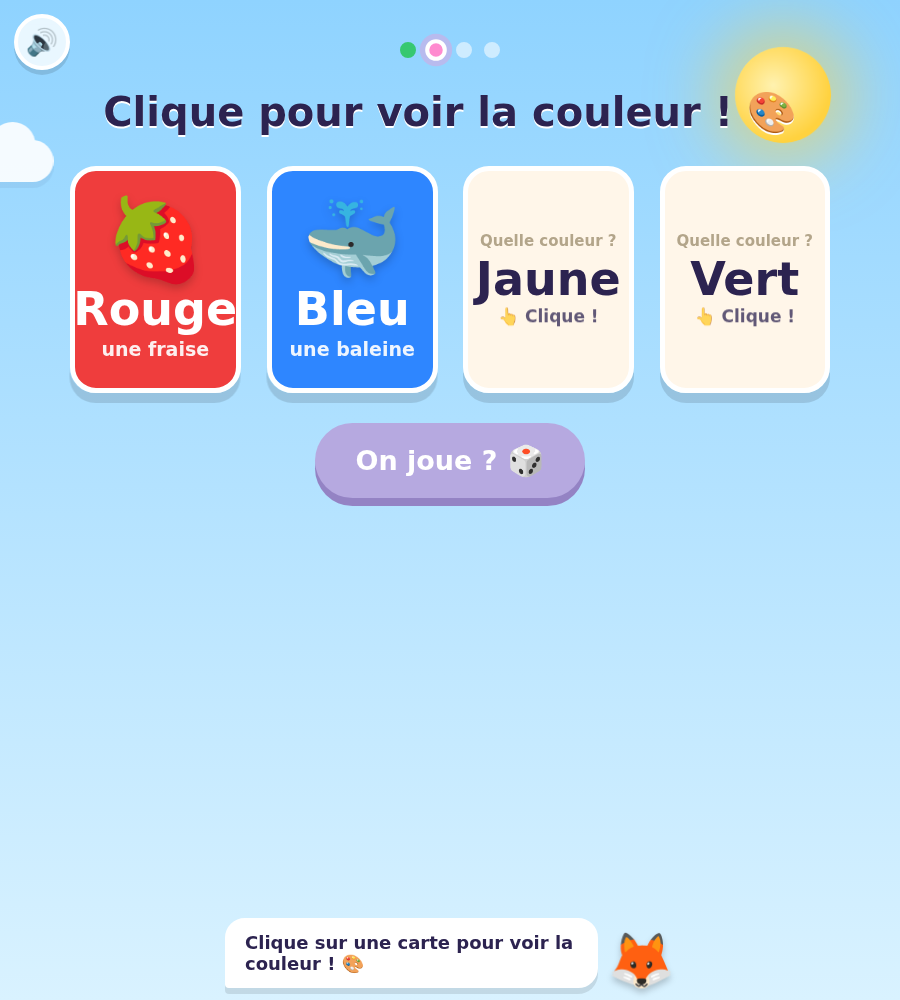
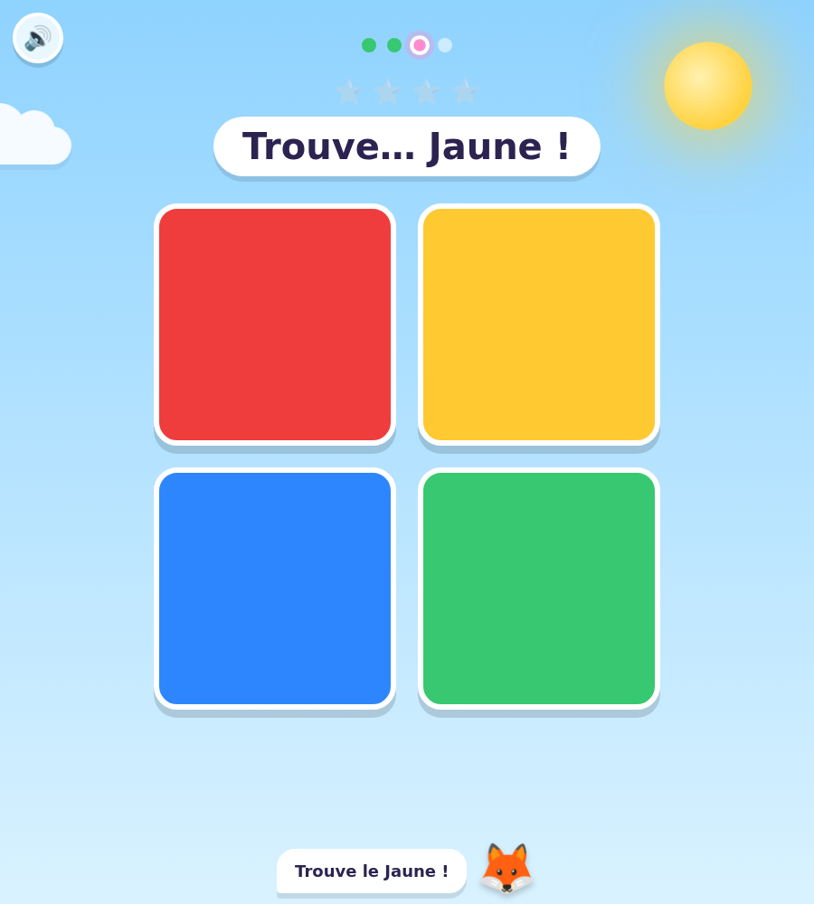
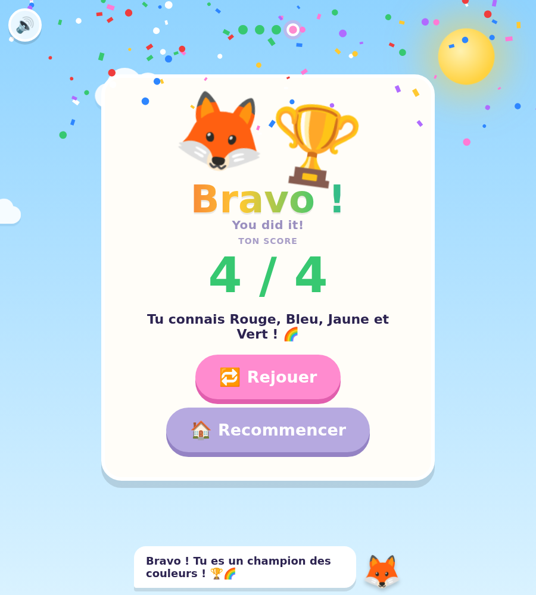

# 🦊 Les Couleurs avec Léo

An interactive, one-page **French colours mini-lesson for a 5-year-old** — no French
background needed. A friendly fox named **Léo** teaches four colours through
flip-to-reveal **flash cards** and a listen-and-find **game**, with everything spoken
aloud in French. Built to be genuinely delightful for a small child: big targets,
big feedback, confetti, and no way to "lose".

> **Rouge · Bleu · Jaune · Vert** — 🍓 🐳 ☀️ 🐸



---

## The flash-card idea (the core mechanic)

Each card starts by showing **only the French word**. The colour is *hidden*.
The child reads (or is read) the word, guesses the colour, and **taps to reveal** it —
turning a flash card into a tiny predict-then-check game. Tap again to flip it back.

| Word showing (front) | Tap → colour revealed (back) |
|---|---|
| "Jaune", "Vert" as plain text | the real colour fills the card + a picture (☀️/🐸) + Léo says the word |



---

## The four screens

1. **Bonjour** — Léo greets the child and sets the scene.
2. **Les Couleurs** — the four flip-to-reveal flash cards.
3. **Le Jeu** — Léo says a colour out loud; the child taps the matching square.
   Right = confetti + "Oui!"; a miss = a gentle shake + "Essaie encore!" (never a fail).
4. **Bravo** — a celebration screen with the score and confetti, then replay.

| The game | The celebration |
|---|---|
|  |  |

---

## Run it

It's plain HTML/CSS/JS with **zero runtime dependencies** — the fastest way is to
just open the file:

```bash
# Option A — double-click index.html, or:
open index.html          # macOS
xdg-open index.html      # Linux
```

Or serve it with the tiny bundled server (nice for sharing on a tablet over Wi-Fi):

```bash
npm start                # → http://localhost:4173
PORT=8080 npm start      # pick a port
```

**Audio note:** the French pronunciation uses the browser's built-in speech
synthesis. It sounds best in Chrome/Edge/Safari with a French voice installed; if
none is available the lesson still works fully (and still plays happy/try-again
sound effects). Use the 🔊 button, top-left, to mute.

---

## Teaching it live

The website *is* a 5-minute lesson you can teach. The full minute-by-minute script,
pronunciation guide, and teaching tips are in **[docs/LESSON_PLAN.md](docs/LESSON_PLAN.md)**.

---

## Project layout

```
index.html            The one page (structure + the four screens)
css/styles.css        The bright, bouncy, big-target look; responsive + reduced-motion
js/colors.js          Single source of truth for the 4 colours (browser + Node)
js/app.js             Léo's little state machine: cards, game, audio, confetti
server.js             Dependency-free static server (also used by the tests)
docs/LESSON_PLAN.md   The teacher's 5-minute script
tests/                Playwright tests (data + full end-to-end journeys)
assets/               Screenshots
```

---

## Tests

The lesson is covered end-to-end with [Playwright](https://playwright.dev/): the data
module is unit-tested in Node, and the full child journey (flip cards, reveal colours,
play the game, celebrate, replay) is driven in a real browser — on both a desktop and a
phone viewport.

```bash
npm test                 # run everything (36 tests: chromium + mobile)
npm run test:headed      # watch it play in a visible browser
npm run test:report      # open the last HTML report
```

What's verified, among other things:

- cards show the **word first** and **reveal the colour only on click** (the core mechanic);
- clicking a card **speaks the French** colour name;
- a **correct** tap celebrates and advances; a **wrong** tap is gentle, doesn't score, and lets you retry;
- playing through all four rounds ends on the celebration with **4 / 4**;
- the **sound toggle** truly silences speech;
- everything is **keyboard-operable** and works at a phone size.

> In CI-like environments Playwright uses the pre-installed Chromium automatically;
> locally, run `npx playwright install chromium` once.

---

## Accessibility & kindness by design

- Big tap targets, high-contrast colours chosen to be distinct for young eyes.
- Every colour is **spoken and shown** (not colour-alone), with `aria-label`s throughout.
- Full **keyboard** support (Tab/Enter/Space, arrow keys between cards) and visible focus rings.
- Respects **`prefers-reduced-motion`** — animations and confetti calm down automatically.
- **No failure states.** Wrong answers are nudges, not buzzers.

---

## License

MIT — teach freely. 🌈
